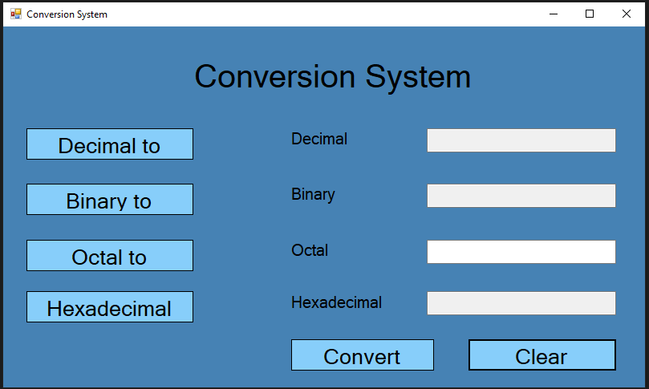

# Conversion System
Conversion System (Decimal, Binary, Octal, Hexadecimal)

# Features
- Windows application for convert numbers (Decimal, Binary, Octal and Hexadecimal)
- C#
- Net Framework 4
- Winforms

# Images

  

  

# Download

